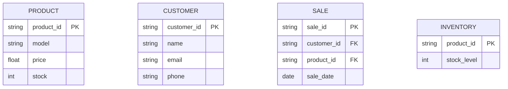

```mermaid
erDiagram
    PRODUCT {
        string product_id PK
        string model
        float price
        int stock
    }
    CUSTOMER {
        string customer_id PK
        string name
        string email
        string phone
    }
    SALE {
        string sale_id PK
        string customer_id FK
        string product_id FK
        date sale_date
    }
    INVENTORY {
        string product_id PK
        int stock_level
    }
```
This diagram gives a good view of how products are sold to customers and how inventory is managed within the system.