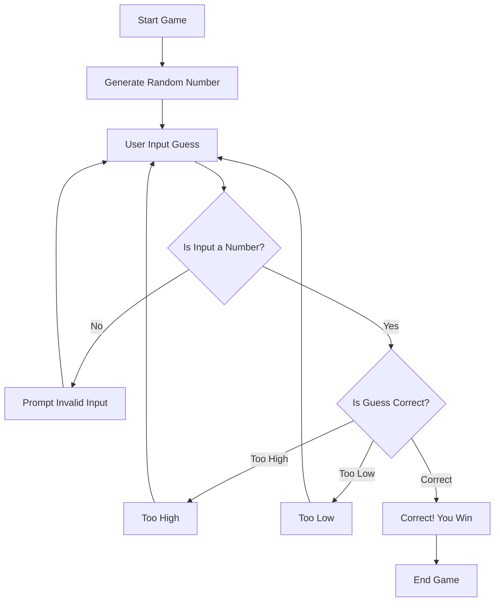

```mermaid
flowchart TD
    A[Start Game] --> B[Generate Random Number]
    B --> C[User Input Guess]
    C --> D{Is Input a Number?}
    D -- No --> E[Prompt Invalid Input]
    E --> C
    D -- Yes --> F{Is Guess Correct?}
    F -- Too High --> G[Too High]
    G --> C
    F -- Too Low --> H[Too Low]
    H --> C
    F -- Correct --> I[Correct! You Win]
    I --> J[End Game]
```

This flowchart shows how the number guessing game operates, guiding the player through the process of guessing a number, and providing feedback until they win the game.
