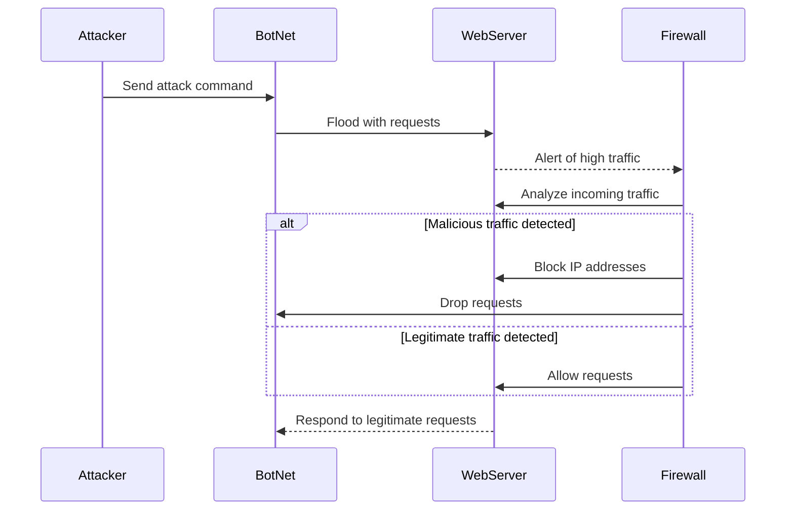

```mermaid
sequenceDiagram
    participant Attacker
    participant BotNet
    participant WebServer
    participant Firewall

    Attacker->>BotNet: Send attack command
    BotNet->>WebServer: Flood with requests
    WebServer-->>Firewall: Alert of high traffic
    Firewall->>WebServer: Analyze incoming traffic
    alt Malicious traffic detected
        Firewall->>WebServer: Block IP addresses
        Firewall->>BotNet: Drop requests
    else Legitimate traffic detected
        Firewall->>WebServer: Allow requests
    end
    WebServer-->>BotNet: Respond to legitimate requests
```

This diagram uses sequence diagrams to show how DDoS attacks and how a firewall  protects the web server by checking and controlling the incoming traffic to keep the website running smoothly.